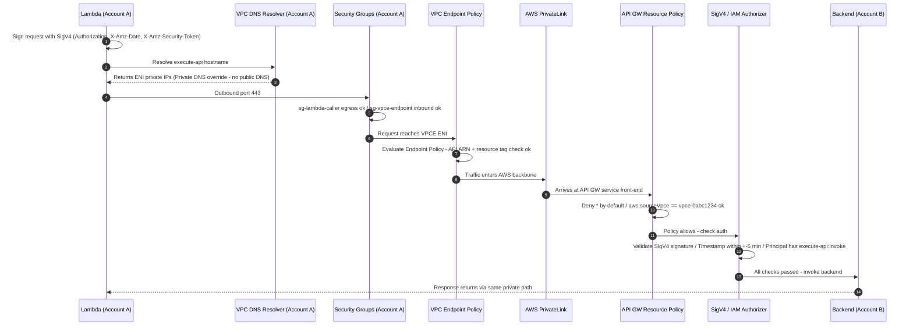

To ensure traffic between a Lambda in **Account A** and a private API Gateway in **Account B** never touches the public internet, this pattern combines Interface VPC Endpoints (AWS PrivateLink) with SigV4 authentication (AWS IAM) across four independent security layers. Every layer must pass independently - no single control is load-bearing on its own.

| Property | Value |
|----------|-------|
| **Network path** | 100% AWS internal backbone - no public internet |
| **Auth layers** | 4 independent controls (SG, Endpoint Policy, Resource Policy, SigV4) |
| **API visibility** | Private endpoint - invisible to the public internet |
| **Replay protection** | SigV4 timestamp skew window ±5 minutes |
| **Cross-account** | IAM trust established on both sides independently |

---

<div class="not-prose my-10 rounded-lg overflow-hidden border border-amber-light shadow-sm">
  <iframe
    src="/visuals/aws-apigateway-privatelink-pattern.html"
    style="width:100%;height:620px;border:none;"
    title="AWS Cross-Account API Gateway PrivateLink Pattern"
    loading="lazy"
  ></iframe>
</div>

---

## When to use this pattern

This pattern fits when all of the following are true:

- The caller (Lambda) and the API are in **different AWS accounts**
- You need a strict guarantee that traffic **never leaves the AWS network**
- The API Gateway is the service boundary - you are not exposing a full VPC
- You need a complete audit trail of every cross-account API invocation

**vs. VPC Peering + NLB:** Peering exposes full VPC address space between accounts and requires route table coordination on both sides. PrivateLink is a one-directional service endpoint - Account A gets access to a specific service, not the whole VPC. Simpler trust boundary, easier to reason about.

**vs. Transit Gateway:** TGW is the right choice for many-to-many connectivity across accounts or on-premises. For a point-to-point service exposure (one consumer, one API), PrivateLink is lower operational overhead and cost.

**vs. Public API Gateway + IP allowlisting:** Puts traffic on the internet and relies on IP ranges that can change. Not appropriate for security-sensitive cross-account calls.

---

## Architecture

```mermaid
flowchart LR
    subgraph AccountA["Account A - Caller"]
        subgraph VPC["VPC (Customer-managed)"]
            subgraph PrivateSubnet["Private Subnets (2+ AZs) - No IGW / No NAT"]
                Lambda["Lambda Function\nIAM Execution Role\nSigV4 Signing"]
                SG_L["SG: sg-lambda-caller\nEgress: 443 to sg-vpce only"]
                VPCE["Interface VPC Endpoint\ncom.amazonaws.REGION.execute-api\nPrivate DNS Enabled\nEndpoint Policy Attached"]
                SG_E["SG: sg-vpce-endpoint\nInbound: 443 from sg-lambda only"]
            end
        end
    end

    subgraph AccountB["Account B - API Owner"]
        APIGW["API Gateway\nendpointType: PRIVATE\nResource Policy: Deny *\naws:sourceVpce allowlist"]
        AUTH["AWS_IAM Authorizer\nSigV4 Verification\nexecute-api:Invoke\nCross-account grant"]
        Backend["Backend Integration\nLambda / HTTP / AWS Service"]
    end

    Lambda -->|"Signs request with SigV4"| SG_L
    SG_L -->|"Port 443 - SG group match"| SG_E
    SG_E --> VPCE
    VPCE -->|"AWS Internal Backbone / PrivateLink"| APIGW
    APIGW -->|"Resource Policy - aws:sourceVpce check"| AUTH
    AUTH -->|"SigV4 valid - Principal authorized"| Backend
```



---

## Traffic flow



---

## Components

### Account A - Caller

**Lambda Function**

- Executes inside a customer-managed VPC (private subnet)
- Carries an IAM Execution Role with `execute-api:Invoke` scoped to specific routes in Account B
- Signs every outbound request using AWS SigV4 via execution role credentials
- Egress controlled by a dedicated Security Group

**Security Group - Lambda (`sg-lambda-caller`)**

- Outbound: Port `443` to `sg-vpce-endpoint` only (group-to-group reference, no IP ranges)
- All other egress implicitly denied
- No inbound rules required

**Private Subnets (2+ AZs)**

- Route table has no `0.0.0.0/0` route - no Internet Gateway, no NAT Gateway
- Traffic to `execute-api` resolves via Private DNS to ENI private IPs only

**Interface VPC Endpoint**

- Service: `com.amazonaws.[region].execute-api`
- Creates ENIs in each private subnet with private IPs from the VPC CIDR
- Private DNS enabled - overrides the public API Gateway hostname VPC-wide
- Endpoint Policy restricts which API ARNs are callable (scoped by ARN and resource tag)

**Security Group - VPCE (`sg-vpce-endpoint`)**

- Inbound: Port `443` from `sg-lambda-caller` only
- Group-to-group reference - no IP range rules, no other sources permitted

---

### Account B - API Owner

**API Gateway**

- `endpointConfiguration: PRIVATE` - unreachable from the public internet
- Resource Policy is deny-first with an explicit allow for the specific VPCE ID

**API Gateway Resource Policy**

- Default: Explicit `Deny *` on `execute-api:Invoke`
- Allow only when `aws:sourceVpce` matches Account A's specific Endpoint ID
- A request with valid SigV4 credentials is still rejected if it arrives via any other path

**SigV4 Authorizer (`authorizationType: AWS_IAM`)**

- Independent second authentication layer
- Validates `Authorization`, `X-Amz-Date`, and `X-Amz-Security-Token` headers against IAM
- Account A's Lambda execution role must be explicitly granted `execute-api:Invoke` in Account B's resource policy

**IAM Cross-Account Invoke Grant**

- Account B's Resource Policy names Account A's Lambda role ARN explicitly
- Scoped to specific `stage/method/route` combinations - never a wildcard resource

---

## Defense-in-depth - Four security layers

| # | Layer | Account | Control | Defeats |
|---|-------|---------|---------|---------|
| 1 | **Security Group Peering** | A | `sg-lambda-caller` to `sg-vpce-endpoint` port 443 | Lateral movement within the VPC - only the Lambda SG qualifies |
| 2 | **VPC Endpoint Policy** | A | IAM resource policy scoped by API ARN + resource tag | Endpoint re-use to reach unintended APIs in the same region |
| 3 | **API GW Resource Policy** | B | Deny `*` unless `aws:sourceVpce` matches | Any request not from the specific VPCE, even with valid credentials |
| 4 | **SigV4 / AWS IAM Auth** | B | `AWS_IAM` authorizer on every route | Unauthenticated requests, impersonation, replay attacks |

> **Important:** Layers 3 and 4 are evaluated **independently**. A spoofed VPCE source still fails SigV4 verification. A valid signature from the wrong network source still fails the Resource Policy. Neither layer alone is sufficient - both must pass.

---

## Reference policies

<details>
<summary>VPC Endpoint Policy - Account A</summary>

Attach directly to the Interface VPC Endpoint. Restricts which API ARN is reachable and enforces a resource tag condition.

```json
{
  "Version": "2012-10-17",
  "Statement": [
    {
      "Sid": "AllowSpecificAPI",
      "Effect": "Allow",
      "Principal": {
        "AWS": "arn:aws:iam::ACCT-A:role/lambda-role"
      },
      "Action": "execute-api:Invoke",
      "Resource": "arn:aws:execute-api:REGION:ACCT-B:API-ID/*",
      "Condition": {
        "StringEquals": {
          "aws:resourceTag/Project": "your-project"
        }
      }
    },
    {
      "Sid": "DenyEverythingElse",
      "Effect": "Deny",
      "Principal": "*",
      "Action": "execute-api:*",
      "Resource": "*",
      "Condition": {
        "StringNotEquals": {
          "aws:resourceTag/Project": "your-project"
        }
      }
    }
  ]
}
```

</details>

<details>
<summary>API Gateway Resource Policy - Account B</summary>

Applied to the Private API Gateway. Deny-first - allows only the specific VPCE ID from Account A, and only for the named Lambda role principal.

```json
{
  "Version": "2012-10-17",
  "Statement": [
    {
      "Sid": "DenyPublicAccess",
      "Effect": "Deny",
      "Principal": "*",
      "Action": "execute-api:Invoke",
      "Resource": "arn:aws:execute-api:REGION:ACCT-B:API-ID/*",
      "Condition": {
        "StringNotEquals": {
          "aws:sourceVpce": "vpce-0abc1234def56789"
        }
      }
    },
    {
      "Sid": "AllowFromVPCEndpoint",
      "Effect": "Allow",
      "Principal": {
        "AWS": "arn:aws:iam::ACCT-A:role/lambda-role"
      },
      "Action": "execute-api:Invoke",
      "Resource": "arn:aws:execute-api:REGION:ACCT-B:API-ID/prod/*",
      "Condition": {
        "StringEquals": {
          "aws:sourceVpce": "vpce-0abc1234def56789"
        }
      }
    }
  ]
}
```

</details>

<details>
<summary>Lambda Execution Role Inline Policy - Account A</summary>

Grants the Lambda role the right to call specific routes in Account B. Scoped to the minimum set of `stage/method/route` combinations.

```json
{
  "Version": "2012-10-17",
  "Statement": [
    {
      "Sid": "AllowAPIInvoke",
      "Effect": "Allow",
      "Action": "execute-api:Invoke",
      "Resource": [
        "arn:aws:execute-api:REGION:ACCT-B:API-ID/prod/GET/items",
        "arn:aws:execute-api:REGION:ACCT-B:API-ID/prod/POST/items"
      ]
    }
  ]
}
```

> **Caution:** Never use `"Resource": "*"` for `execute-api:Invoke` in a cross-account context. Always scope to the minimum `stage/method/route` ARN combinations required.

</details>

---

## SigV4 request signing

Uses `boto3`'s built-in `SigV4Auth` - no manual HMAC implementation required.

```python
import boto3
import requests
from botocore.auth import SigV4Auth
from botocore.awsrequest import AWSRequest

session = boto3.Session()
credentials = session.get_credentials()
region = "us-east-1"

url = "https://API-ID.execute-api.REGION.amazonaws.com/prod/items"

req = AWSRequest(method="GET", url=url)
SigV4Auth(credentials, "execute-api", region).add_auth(req)

# Headers injected by SigV4Auth:
# - Authorization (HMAC-SHA256 signature)
# - X-Amz-Date (request timestamp)
# - X-Amz-Security-Token (if using temporary credentials / role)
response = requests.get(url, headers=dict(req.headers))
```

> **Tip:** When running inside a VPC-attached Lambda, `boto3.Session()` automatically uses the execution role's temporary credentials via the Lambda credentials provider chain. No explicit credential management is needed.

---

## Terraform

Key resources for Account A. The security group pair uses group-to-group references - no CIDR blocks.

```hcl
# Interface VPC Endpoint for API Gateway
resource "aws_vpc_endpoint" "execute_api" {
  vpc_id              = var.vpc_id
  service_name        = "com.amazonaws.${var.region}.execute-api"
  vpc_endpoint_type   = "Interface"
  subnet_ids          = var.private_subnet_ids
  security_group_ids  = [aws_security_group.vpce.id]
  private_dns_enabled = true

  policy = data.aws_iam_policy_document.vpce_policy.json

  tags = {
    Name    = "${var.project}-execute-api-vpce"
    Project = var.project
  }
}

# Security group for the VPCE ENIs
resource "aws_security_group" "vpce" {
  name        = "sg-vpce-endpoint"
  description = "Allow inbound 443 from Lambda SG only"
  vpc_id      = var.vpc_id
}

resource "aws_security_group_rule" "vpce_inbound" {
  type                     = "ingress"
  from_port                = 443
  to_port                  = 443
  protocol                 = "tcp"
  security_group_id        = aws_security_group.vpce.id
  source_security_group_id = aws_security_group.lambda.id
  description              = "HTTPS from Lambda SG only"
}

# Security group for the Lambda function
resource "aws_security_group" "lambda" {
  name        = "sg-lambda-caller"
  description = "Allow outbound 443 to VPCE SG only"
  vpc_id      = var.vpc_id
}

resource "aws_security_group_rule" "lambda_egress" {
  type                     = "egress"
  from_port                = 443
  to_port                  = 443
  protocol                 = "tcp"
  security_group_id        = aws_security_group.lambda.id
  source_security_group_id = aws_security_group.vpce.id
  description              = "HTTPS to VPCE SG only"
}

# Endpoint policy - scoped to specific API ARN and resource tag
data "aws_iam_policy_document" "vpce_policy" {
  statement {
    sid    = "AllowSpecificAPI"
    effect = "Allow"
    principals {
      type        = "AWS"
      identifiers = [aws_iam_role.lambda.arn]
    }
    actions   = ["execute-api:Invoke"]
    resources = ["arn:aws:execute-api:${var.region}:${var.acct_b_id}:${var.api_id}/*"]
    condition {
      test     = "StringEquals"
      variable = "aws:resourceTag/Project"
      values   = [var.project]
    }
  }

  statement {
    sid    = "DenyEverythingElse"
    effect = "Deny"
    principals {
      type        = "*"
      identifiers = ["*"]
    }
    actions   = ["execute-api:*"]
    resources = ["*"]
    condition {
      test     = "StringNotEquals"
      variable = "aws:resourceTag/Project"
      values   = [var.project]
    }
  }
}
```

> **Note:** The API Gateway resource policy (Account B side) must be applied separately in Account B's Terraform workspace using `aws_api_gateway_rest_api_policy`. Both policies must allow the request - coordinate deployment across both accounts.

---

## Cost

Interface VPC Endpoints are not free. Factor this in before deploying.

| Line item | Rate | Monthly estimate (2 AZs) |
|-----------|------|--------------------------|
| Endpoint-hours | $0.01 / AZ / hour | ~$14.60 |
| Data processed | $0.01 / GB | Workload-dependent |

For comparison, the alternative (NAT Gateway) costs ~$32/AZ/month plus $0.045/GB - and routes traffic via the public internet. PrivateLink is cheaper and more secure once you account for NAT Gateway costs in the baseline.

One endpoint serves all Lambdas in the VPC targeting `execute-api`. The per-AZ cost is shared across all callers in that VPC, not per-function.

---

## Prerequisites and gotchas

> **Warning:** Private DNS is VPC-wide. Enabling Private DNS on the VPCE overrides `execute-api` resolution for every Lambda in the VPC - not just the one targeting Account B's API. All API Gateway calls in that VPC will route through the endpoint. Plan your VPC topology before enabling.

> **Warning:** Both policies must allow independently. The VPCE Endpoint Policy (Account A) and the API GW Resource Policy (Account B) are both evaluated. Either one denying the request is sufficient to block it. This is the most common misconfiguration when debugging cross-account access failures.

> **Warning:** Cross-account IAM trust requires both sides. When `authorizationType: AWS_IAM` is set, Account B's Resource Policy must explicitly name Account A's Lambda role ARN in the Allow statement. Account A's role having `execute-api:Invoke` in its own policy is necessary but not sufficient alone.

> **Warning:** SigV4 timestamp skew. AWS rejects requests where `X-Amz-Date` is more than ±5 minutes from server time. Lambda execution environments are NTP-synced by default - watch for custom runtimes or container images that may drift.

> **Note:** Lambda VPC cold start latency. VPC-attached Lambda has higher cold start latency due to ENI provisioning. Use Provisioned Concurrency if your latency SLA is strict. SnapStart is available for Java runtimes.

> **Tip:** Multi-AZ VPCE for HA. Create the Interface VPC Endpoint in at least two AZs. Each AZ gets its own ENI with a distinct private IP. Route table entries are per-subnet.

> **Tip:** Observability. Enable CloudTrail Data Events for `execute-api` and VPC Flow Logs on VPCE ENIs. This provides a complete audit trail for all cross-account API calls - critical for incident response and compliance evidence. A 403 from API Gateway means the Resource Policy denied the request; a 401 means SigV4 auth failed. These are different failure modes and require different remediation.

> **Tip:** Least-privilege IAM. Scope `execute-api:Invoke` Resource ARNs to specific `stage/method/route` combinations in both the Lambda execution role policy and the API GW Resource Policy Allow statement.
